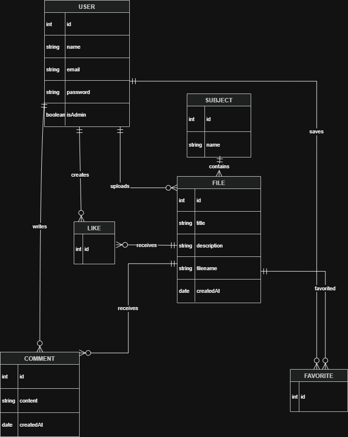
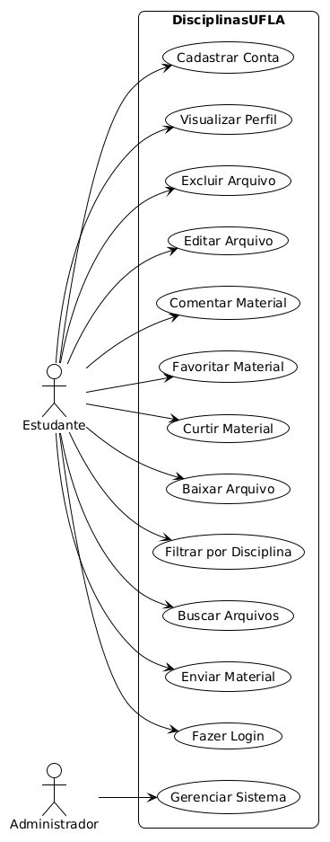

# Modelagem do Sistema — DisciplinasUFLA

## 1. Visão Geral
Este documento apresenta os modelos e diagramas elaborados para representar a estrutura e o comportamento da aplicação web DisciplinasUFLA. O sistema foi modelado utilizando banco de dados relacional com PostgreSQL e Prisma ORM. O objetivo desta modelagem é organizar usuários, arquivos acadêmicos, disciplinas e interações sociais (comentários, curtidas e favoritos), garantindo a integridade dos dados e embasando a implementação do projeto.

## 2. Elementos Principais do Sistema (Entidades)
Nesta seção, identificamos as entidades fundamentais que compõem a estrutura principal da aplicação e suas responsabilidades:

* **User (Usuário):** Representa os estudantes da plataforma. Responsável pela autenticação, envio de arquivos e interações sociais. (Atributos principais: `id`, `name`, `email`, `password`, `isAdmin`).
* **File (Arquivo/Material):** Representa os materiais acadêmicos enviados. (Atributos principais: `id`, `title`, `description`, `filename`, `createdAt`).
* **Subject (Disciplina):** Representa as disciplinas cadastradas no sistema, funcionando como o agrupador principal dos materiais. (Atributos principais: `id`, `name`).
* **Interações Sociais:**
  * **Comment:** Comentários feitos pelos usuários nos arquivos.
  * **Like:** Tabela intermediária que gerencia as curtidas dos usuários nos materiais.
  * **Favorite:** Tabela intermediária que gerencia os arquivos salvos pelo usuário para acesso rápido.

## 3. Representação e Modelos

### 3.1. Diagrama Entidade-Relacionamento (DER)

**Descrição Textual dos Relacionamentos:** O modelo de dados demonstra as seguintes relações estruturais:
* **1:N (Um para Muitos):** * `User → File`: Um usuário pode enviar vários arquivos.
  * `Subject → File`: Uma disciplina pode possuir vários arquivos.
  * `File → Comment` e `User → Comment`: Um arquivo recebe vários comentários e um usuário faz vários comentários.
* **N:N (Muitos para Muitos):**
  * `User ↔ File (Like)`: Usuários curtem vários arquivos e arquivos recebem várias curtidas.
  * `User ↔ File (Favorite)`: Usuários favoritam vários arquivos e arquivos são favoritados por vários usuários.

### 3.2. Diagrama de Casos de Uso

**Descrição Textual:** O diagrama apresenta as principais ações realizadas pelos estudantes dentro da plataforma, como envio de arquivos, buscas, comentários e curtidas. 

## 4. Rastreabilidade (Requisitos x Modelos)
A tabela a seguir demonstra como a modelagem do banco de dados atende aos requisitos levantados nas Sprints anteriores:

| Identificador do Requisito | Descrição do Requisito | Elemento no Modelo que o Atende |
| :--- | :--- | :--- |
| REQ-01 | O usuário deve poder enviar e visualizar arquivos acadêmicos. | Entidade `File` e seu relacionamento (1:N) com a entidade `User`. |
| REQ-02 | Os materiais devem ser categorizados por matérias da universidade. | Entidade `Subject` e seu relacionamento (1:N) com a entidade `File`. |
| REQ-03 | O sistema deve possuir um sistema de curtidas e favoritos. | Tabelas intermediárias/Entidades `Like` e `Favorite` (Relacionamentos N:N). |
| REQ-04 | Os usuários devem poder comentar nos materiais de estudo. | Entidade `Comment`, vinculando `User` e `File`. |

## 5. Tecnologias Utilizadas na Modelagem
* **PostgreSQL:** Sistema de Gerenciamento de Banco de Dados Relacional.
* **Prisma ORM:** Ferramenta de mapeamento objeto-relacional utilizada para definir o *schema* e gerenciar as migrações de forma tipada.
* **Docker:** Utilizado para conteinerização do ambiente de banco de dados durante o desenvolvimento.

## 6. Refinamento do Escopo e Alinhamento
Durante a etapa de modelagem de dados, a estrutura foi desenhada para suportar não apenas o envio de arquivos, mas as funcionalidades de interação entre usuários de forma organizada. O uso das tabelas intermediárias (`Like` e `Favorite`) facilitou a implementação das funcionalidades de interação propostas no Product Backlog inicial, sem comprometer o desenvolvimento do projeto para a entrega da aplicação web.