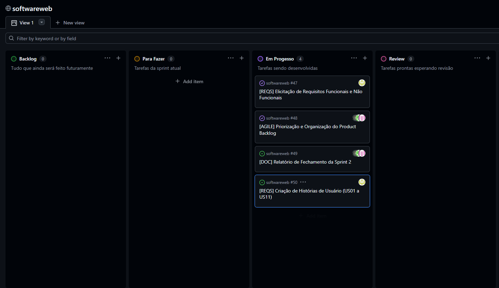

# Sprint 02

## 1. Identificação

- **Número da sprint:** 2
- **Período:** 11/04/2026 a 25/04/2026
- **Data da entrega:** 25/04/2026

| Integrante | Papel no Scrum |
|---|---|
| Thiago Vinícius Tristão Rojas | Product Owner |
| Bruno Santos Vilas Boas | Scrum Master |
| Christian Silva Mesquita | Dev Team |
| Guilherme dos Santos Fernandes | Dev Team |
| Matheus Levi Tavares | Dev Team |

---

## 2. Objetivo da Sprint

Identificar, descrever, organizar e priorizar os requisitos da plataforma de compartilhamento de materiais acadêmicos, produzindo a lista de requisitos funcionais, não funcionais e as histórias de usuário correspondentes.

---

## 3. Itens do Sprint Backlog

| ID | Atividade | Responsável | Status |
|---|---|---|---|
| S2-01 | Levantamento dos requisitos funcionais | Todos | Concluído |
| S2-02 | Levantamento dos requisitos não funcionais | Todos | Concluído |
| S2-03 | Criação das histórias de usuário | Thiago / Christian | Concluído |
| S2-04 | Definição dos critérios de aceitação | Thiago | Concluído |
| S2-05 | Priorização do Product Backlog | Thiago | Concluído |
| S2-06 | Organização dos requisitos como Issues no GitHub | Bruno | Concluído |
| S2-07 | Criação do arquivo sprint-02.md | Bruno | Concluído |

---

## 4. Relação com o Conteúdo da Disciplina

Esta sprint está diretamente relacionada ao conteúdo de **Requisitos de Software**. As atividades realizadas — elicitação, organização, priorização e documentação de requisitos funcionais e não funcionais — correspondem às técnicas fundamentais da engenharia de requisitos estudadas na disciplina. A criação de histórias de usuário com critérios de aceitação mensuráveis reflete a abordagem ágil de especificação de requisitos, alinhada ao uso do Scrum no projeto.

---

## 5. Artefatos Produzidos

- Lista de 11 requisitos funcionais (RF01 a RF11) com estimativas e critérios de aceitação mensuráveis
- Lista de 7 requisitos não funcionais (RNF01 a RNF07) com critérios quantitativos
- 11 histórias de usuário (US01 a US11) com critérios de aceitação definidos
- Product Backlog atualizado e priorizado
- Sprint Backlog da Sprint 2
- Documentação publicada no GitHub
- Arquivo `docs/sprints/sprint-02.md`

---

## 6. Evolução da Aplicação Web

Nesta sprint, o foco foi o levantamento e a documentação dos requisitos. Não houve desenvolvimento de código da aplicação. Os requisitos levantados definem o escopo funcional e as restrições de qualidade que guiarão o desenvolvimento nas próximas sprints, em especial a implementação do cadastro de usuários, autenticação, upload e download de arquivos.

---

## 7. Dificuldades Encontradas

- A definição de critérios de aceitação mensuráveis (com percentuais e tempos de resposta) exigiu discussão sobre o que seria tecnicamente viável dado o escopo do projeto.
- A priorização dos itens do backlog gerou debate sobre quais funcionalidades compõem o MVP (Mínimo Produto Viável) do sistema.

---

## 8. Revisão do Incremento

- **O que foi concluído:** Todos os requisitos funcionais e não funcionais foram levantados, documentados e priorizados. As histórias de usuário foram criadas com critérios de aceitação claros. O Product Backlog foi atualizado e publicado no GitHub.
- **O que ficou pendente:** A modelagem do sistema, incluindo diagramas UML, ficou reservada para a Sprint 3.

---

## 9. Pendências para a Próxima Sprint

- Criação do diagrama de classes com as principais entidades do sistema
- Criação do diagrama de sequência representando o fluxo de upload
- Documentação textual dos modelos produzidos
- Vinculação dos modelos aos requisitos levantados nesta sprint

---

## 10. Product Backlog Atualizado

| ID | Tipo | Item do Backlog | Descrição | Prioridade | Critérios de Aceitação | Estimativa | Sprint Prevista |
|---|---|---|---|---|---|---|---|
| RF01 | Requisito Funcional | Tela e Lógica de Login | Sistema de autenticação de usuários | Alta | 100% dos logins devem aceitar apenas e-mails @estudante.ufla.br e autenticar em até 2s | 3 pts | Sprint 5 |
| RF02 | Requisito Funcional | Tela de Envio de Material | Interface para upload de arquivos | Alta | Upload concluído em até 5s para arquivos de até 100MB em 95% dos casos | 5 pts | Sprint 5 |
| RF03 | Requisito Funcional | Tela de Busca | Interface para procurar materiais | Média | Busca retorna resultados em até 2s e filtra corretamente em 100% dos testes | 3 pts | Sprint 5 |
| RF04 | Requisito Funcional | Função de Download | Lógica para baixar arquivos | Média | Download inicia em até 2s após clique e completa sem erro em 95% dos casos | 4 pts | Sprint 6 |
| RF05 | Requisito Funcional | Exclusão de Material | Autor pode apagar seu envio | Média | Apenas o autor consegue excluir e a ação é concluída em até 2s em 100% dos testes | 2 pts | Sprint 5 |
| RF06 | Requisito Funcional | Cadastro de Usuário | Criação de conta no sistema | Alta | Cadastro concluído em até 3s e dados armazenados corretamente em 100% dos testes | 3 pts | Sprint 4 |
| RF07 | Requisito Funcional | Logout | Encerramento de sessão do usuário | Baixa | Logout realizado em até 1s em 100% dos testes | 1 pt | Sprint 4 |
| RF08 | Requisito Funcional | Visualização de Arquivos | Listagem de materiais disponíveis | Alta | Lista de arquivos carrega em até 2s em 95% dos acessos | 3 pts | Sprint 5 |
| RF09 | Requisito Funcional | Associação de Arquivos | Vincular arquivo ao autor | Alta | 100% dos arquivos corretamente associados ao usuário que realizou o upload | 2 pts | Sprint 4 |
| RF10 | Requisito Funcional | Filtro por Disciplina | Listar arquivos por disciplina | Média | Filtro retorna resultados corretos em até 2s em 95% dos testes | 3 pts | Sprint 6 |
| RF11 | Requisito Funcional | Sistema de Likes | Usuários podem curtir arquivos | Média | Usuário autenticado curte/descurte em até 1s e contagem atualiza em 100% dos testes | 3 pts | Sprint 6 |
| RNF01 | Requisito Não Funcional | Restrição de Tamanho | Limite de upload de 100MB | Alta | 100% dos uploads acima de 100MB rejeitados automaticamente | 2 pts | Sprint 4 |
| RNF02 | Requisito Não Funcional | Plataforma Web | Execução no navegador | Alta | Sistema funciona em 100% dos testes nos navegadores Chrome, Firefox e Edge (últimas 2 versões) | 1 pt | Sprint 3 |
| RNF03 | Requisito Não Funcional | Usabilidade | Facilidade de uso | Alta | Usuário realiza upload ou download em no máximo 3 cliques em 90% dos testes de uso | 5 pts | Sprint 5 |
| RNF04 | Requisito Não Funcional | Estabilidade | Operação contínua | Alta | Disponibilidade ≥ 99% e suporte a pelo menos 100 usuários simultâneos sem falhas críticas | 3 pts | Sprint 4 |
| RNF05 | Requisito Não Funcional | Segurança | Proteção de dados | Alta | 100% das senhas armazenadas com criptografia; acessos não autorizados bloqueados em testes | 4 pts | Sprint 4 |
| RNF06 | Requisito Não Funcional | Tempo de Resposta | Desempenho geral | Alta | 95% das requisições respondidas em até 3s | 3 pts | Sprint 5 |
| RNF07 | Requisito Não Funcional | Integridade de Dados | Consistência dos arquivos | Alta | 100% dos arquivos mantêm integridade após upload e download | 3 pts | Sprint 5 |

---

## 11. Histórias de Usuário

### US01
Como estudante, eu quero me cadastrar no sistema usando meu e-mail institucional, para que eu possa acessar a plataforma com segurança.

**Critérios de aceitação:**
- O sistema deve permitir cadastro apenas com e-mails @estudante.ufla.br
- O cadastro deve ser concluído em até 3 segundos
- O sistema deve impedir cadastros duplicados

---

### US02
Como usuário, eu quero fazer login no sistema, para que eu possa acessar minhas funcionalidades.

**Critérios de aceitação:**
- O login deve aceitar apenas e-mails institucionais
- A autenticação deve ocorrer em até 2 segundos
- O sistema deve exibir erro para credenciais inválidas

---

### US03
Como usuário, eu quero fazer logout do sistema, para que eu possa encerrar minha sessão com segurança.

**Critérios de aceitação:**
- O logout deve encerrar a sessão em até 1 segundo
- O usuário deve ser redirecionado para a tela inicial ou de login

---

### US04
Como estudante, eu quero enviar arquivos acadêmicos, para que eu possa compartilhar materiais com outros alunos.

**Critérios de aceitação:**
- Deve existir um botão para selecionar arquivo
- O upload deve aceitar arquivos de até 100MB
- O envio deve ser concluído em até 5 segundos em 95% dos casos
- Apenas usuários autenticados podem enviar arquivos

---

### US05
Como usuário, eu quero visualizar os arquivos disponíveis, para que eu possa encontrar materiais de estudo.

**Critérios de aceitação:**
- A lista de arquivos deve carregar em até 2 segundos
- Os arquivos devem exibir informações básicas (nome, autor, disciplina)

---

### US06
Como usuário, eu quero buscar arquivos, para que eu possa encontrar conteúdos específicos.

**Critérios de aceitação:**
- Deve existir uma barra de pesquisa
- A busca deve retornar resultados em até 2 segundos
- Os resultados devem ser corretos em 100% dos testes

---

### US07
Como usuário, eu quero filtrar arquivos por disciplina, para que eu possa facilitar minha busca por conteúdo.

**Critérios de aceitação:**
- Deve existir filtro por disciplina
- O filtro deve retornar resultados corretos em até 2 segundos

---

### US08
Como usuário, eu quero baixar arquivos, para que eu possa acessar os materiais offline.

**Critérios de aceitação:**
- O download deve iniciar em até 2 segundos
- O arquivo deve ser baixado sem corrupção em 95% dos casos

---

### US09
Como usuário, eu quero que cada arquivo mostre quem enviou, para que eu possa identificar a autoria do material.

**Critérios de aceitação:**
- 100% dos arquivos devem exibir o autor
- O autor deve ser o usuário que realizou o upload

---

### US10
Como usuário, eu quero excluir meus arquivos enviados, para que eu possa gerenciar meus conteúdos.

**Critérios de aceitação:**
- Apenas o autor pode excluir o arquivo
- Deve haver confirmação antes da exclusão
- A exclusão deve ser concluída em até 2 segundos

---

### US11
Como usuário, eu quero que o sistema seja rápido e estável, para que não atrapalhe meus estudos.

**Critérios de aceitação:**
- O sistema deve responder em até 3 segundos em 95% das requisições
- O sistema deve suportar pelo menos 100 usuários simultâneos
- O sistema deve ter disponibilidade mínima de 99%

---

## 12. Quadro Kanban (Sprint 2)

