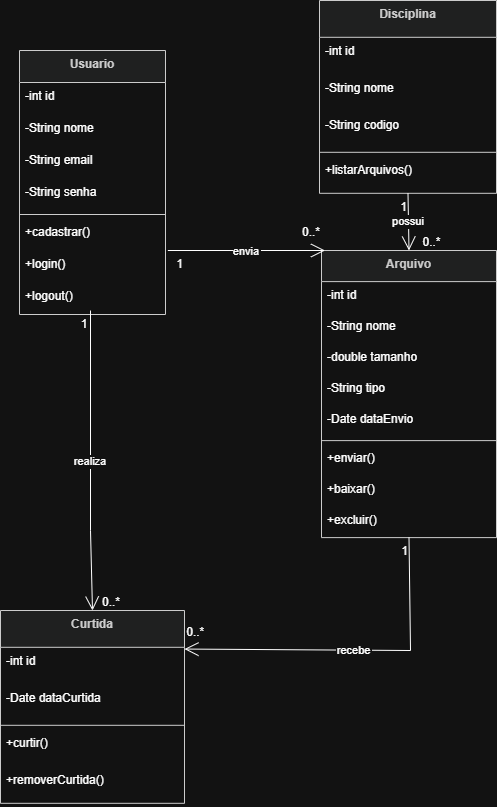

# Sprint 03 

## 1. Identificação do Grupo

Projeto: DisciplinasUFLA

| Integrante | Papel no Scrum |
|---|---|
| Thiago Vinícius Tristão Rojas | Product Owner |
| Bruno Santos Vilas Boas | Scrum Master |
| Christian Silva Mesquita | Dev Team |
| Guilherme dos Santos Fernandes | Dev Team |
| Matheus Levi Tavares | Dev Team |

Data da Sprint: 25/04/2026 a 02/05/2026

## 2. Objetivo da Sprint

Modelar o sistema DisciplinasUFLA por meio de diagramas UML, representando a estrutura principal da aplicação e o fluxo de envio de arquivos acadêmicos.

## 3. Itens do Sprint Backlog

| ID | Tipo | Item do backlog | Descrição | Prioridade | Critérios de aceitação | Status |
|---|---|---|---|---|---|---|
| M01 | Modelagem | Diagrama de Classes | Representar as principais entidades do sistema e seus relacionamentos | Alta | Diagrama deve conter Usuário, Arquivo, Disciplina e Curtida | Concluído |
| M02 | Modelagem | Diagrama de Sequência | Representar o fluxo de upload de arquivo | Alta | Diagrama deve mostrar usuário, tela de upload, sistema e banco de dados | Concluído |
| M03 | Documentação | Explicação dos modelos | Descrever o objetivo dos diagramas produzidos | Média | Cada diagrama deve possuir uma explicação textual | Concluído |

## 4. Diagramas Produzidos

### 4.1 Diagrama de Classes

O diagrama de classes representa a estrutura principal do sistema DisciplinasUFLA. Ele apresenta as entidades Usuario, Arquivo, Disciplina e Curtida, além dos principais atributos, métodos e relacionamentos entre elas.

A classe Usuario representa o estudante cadastrado na plataforma. A classe Arquivo representa os materiais acadêmicos enviados pelos usuários. A classe Disciplina organiza os arquivos de acordo com a matéria correspondente. A classe Curtida representa a interação dos usuários com os arquivos compartilhados.

### 4.2 Diagrama de Sequência

O diagrama de sequência representa o fluxo de envio de arquivo no sistema. O processo inicia quando o usuário seleciona um arquivo e uma disciplina na tela de upload. Em seguida, a tela envia os dados ao sistema, que valida o tamanho e o tipo do arquivo.

Caso o arquivo seja válido, o sistema salva os dados no banco de dados e retorna uma mensagem de sucesso ao usuário. Caso o arquivo ultrapasse o limite permitido, o sistema retorna uma mensagem de erro.

Inserir aqui a imagem do diagrama de sequência.

## 5. Relação com os Requisitos da Sprint 2

Os modelos produzidos nesta sprint estão relacionados aos seguintes requisitos definidos na Sprint 2:

| Requisito | Relação com a Sprint 3 |
|---|---|
| RF02 - Tela de Envio de Material | Representado no diagrama de sequência pelo fluxo de upload |
| RF08 - Visualização de Arquivos | Relacionado à classe Arquivo |
| RF09 - Associação de Arquivos | Representado pela relação entre Usuario e Arquivo |
| RF10 - Filtro por Disciplina | Representado pela relação entre Disciplina e Arquivo |
| RF11 - Sistema de Likes | Representado pela classe Curtida |
| RNF01 - Restrição de Tamanho | Representado na validação do diagrama de sequência |

## 6. Dificuldades Encontradas

A principal dificuldade encontrada foi transformar os requisitos definidos na Sprint 2 em modelos UML. Também foi necessário decidir quais classes seriam essenciais para representar a estrutura inicial do sistema sem deixar o diagrama excessivamente complexo.

## 7. Resultados Obtidos

Ao final da Sprint 3, foram produzidos dois modelos UML: o diagrama de classes e o diagrama de sequência. Esses diagramas ajudaram a representar a estrutura do sistema e o comportamento do fluxo de upload de arquivos, servindo como base para as próximas etapas do projeto.