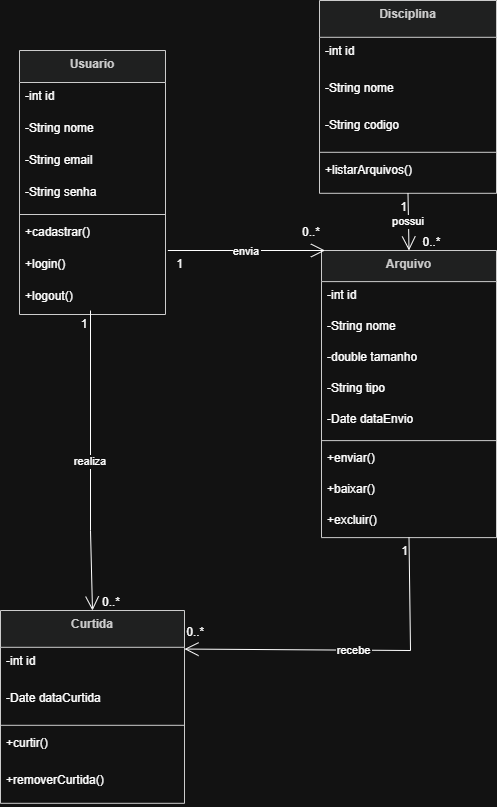
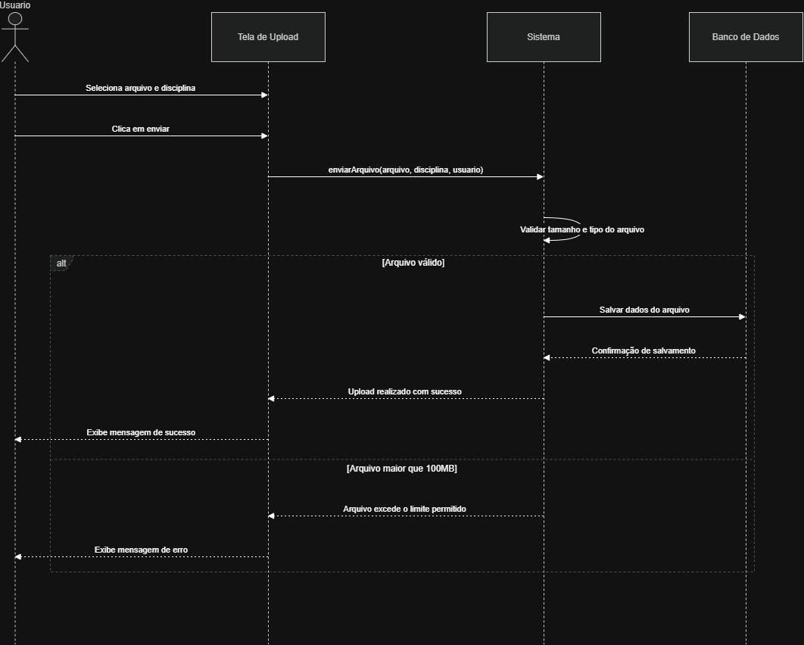

# Sprint 03
 
## 1. Identificação
 
- **Número da sprint:** 3
- **Período:** 25/04/2026 a 02/05/2026
- **Data da entrega:** 02/05/2026
| Integrante | Papel no Scrum |
|---|---|
| Thiago Vinícius Tristão Rojas | Product Owner |
| Bruno Santos Vilas Boas | Scrum Master |
| Christian Silva Mesquita | Dev Team |
| Guilherme dos Santos Fernandes | Dev Team |
| Matheus Levi Tavares | Dev Team |
 
---
 
## 2. Objetivo da Sprint
 
Modelar o sistema DisciplinasUFLA por meio de diagramas UML, representando a estrutura principal da aplicação e o fluxo de envio de arquivos acadêmicos.
 
---
 
## 3. Itens do Sprint Backlog
 
| ID | Tipo | Item do Backlog | Descrição | Prioridade | Critérios de Aceitação | Status |
|---|---|---|---|---|---|---|
| M01 | Modelagem | Diagrama de Classes | Representar as principais entidades do sistema e seus relacionamentos | Alta | Diagrama deve conter as classes Usuário, Arquivo, Disciplina e Curtida | Concluído |
| M02 | Modelagem | Diagrama de Sequência | Representar o fluxo de upload de arquivo | Alta | Diagrama deve mostrar usuário, tela de upload, sistema e banco de dados | Concluído |
| M03 | Documentação | Descrição dos modelos | Descrever o objetivo e a estrutura dos diagramas produzidos | Média | Cada diagrama deve possuir uma explicação textual associada | Concluído |
| M04 | Documentação | Vínculo requisitos-modelos | Relacionar os modelos produzidos aos requisitos da Sprint 2 | Média | Tabela de rastreabilidade entre requisitos e modelos | Concluído |
 
---
 
## 4. Relação com o Conteúdo da Disciplina
 
Esta sprint está diretamente relacionada ao conteúdo de **Modelagem de Software**. A produção de diagramas UML (Diagrama de Classes e Diagrama de Sequência) reflete a tradução dos requisitos levantados na Sprint 2 em representações estruturadas e comportamentais do sistema. O Diagrama de Classes evidencia a estrutura estática do sistema (entidades e relacionamentos), enquanto o Diagrama de Sequência ilustra o comportamento dinâmico de um dos principais fluxos da aplicação (upload de arquivo), alinhando-se às técnicas de modelagem orientada a objetos estudadas na disciplina.
 
---
 
## 5. Artefatos Produzidos
 
- Diagrama de Classes contendo as entidades: `Usuario`, `Arquivo`, `Disciplina` e `Curtida`, com atributos, métodos e relacionamentos
- Diagrama de Sequência representando o fluxo completo de upload de arquivo (incluindo caminho de erro para arquivos acima de 100MB)
- Descrição textual complementar de cada diagrama
- Tabela de rastreabilidade vinculando os modelos produzidos aos requisitos da Sprint 2
- Arquivo `docs/sprints/sprint-03.md`
---
 
## 6. Evolução da Aplicação Web
 
Nesta sprint, o foco foi a modelagem do sistema. Não houve desenvolvimento de código da aplicação. Os diagramas produzidos servem como base para as decisões de implementação das próximas sprints, especialmente a estrutura de entidades do banco de dados (derivada do Diagrama de Classes) e a lógica do serviço de upload (derivada do Diagrama de Sequência).
 
---
 
## 7. Dificuldades Encontradas
 
- A principal dificuldade foi a elaboração dos diagramas em notação UML, especialmente quanto às convenções de multiplicidade e ao detalhamento adequado dos métodos em cada classe.
- Foi necessário decidir quais classes seriam essenciais para representar a estrutura inicial do sistema sem tornar o diagrama excessivamente complexo para o escopo atual do projeto.
---
 
## 8. Revisão do Incremento
 
- **O que foi concluído:** Os dois diagramas UML foram elaborados e publicados no repositório, acompanhados de descrição textual e da tabela de rastreabilidade com os requisitos da Sprint 2. Todos os itens do Sprint Backlog foram concluídos.
- **O que ficou pendente:** Nenhum item ficou pendente. A definição das decisões de projeto e da arquitetura modular da solução ficou reservada para a Sprint 4.
---
 
## 9. Pendências para a Próxima Sprint
 
- Decomposição da solução em módulos (camada de apresentação, serviços e persistência)
- Definição e justificativa das principais decisões de projeto (tecnologias, padrões adotados)
- Análise de alternativas de implementação
- Atualização do Product Backlog com base nas definições técnicas
---

## 10. Diagramas Produzidos
 
### 10.1 Diagrama de Classes
 
O diagrama de classes representa a estrutura principal do sistema DisciplinasUFLA. Apresenta as entidades `Usuario`, `Arquivo`, `Disciplina` e `Curtida`, além dos principais atributos, métodos e relacionamentos entre elas.

- **Usuario:** representa o estudante cadastrado na plataforma, responsável pelo envio e gerenciamento de seus arquivos.
- **Arquivo:** representa os materiais acadêmicos enviados pelos usuários, armazenando metadados como nome, caminho, tipo e data de envio.
- **Disciplina:** organiza os arquivos de acordo com a matéria correspondente, permitindo filtragem por disciplina.
- **Curtida:** representa a interação dos usuários com os arquivos compartilhados, vinculando um usuário a um arquivo curtido.

---
 
### 10.2 Diagrama de Sequência
 
O diagrama de sequência representa o fluxo de envio de arquivo no sistema. O processo inicia quando o usuário seleciona um arquivo e uma disciplina na tela de upload. A tela envia os dados ao sistema, que valida o tamanho e o tipo do arquivo.
 
- Se o arquivo for válido (≤ 100MB), o sistema persiste os dados no banco e retorna uma mensagem de sucesso ao usuário.
- Se o arquivo ultrapassar o limite permitido, o sistema rejeita o upload e retorna uma mensagem de erro.

---
 
## 11. Rastreabilidade: Requisitos × Modelos
 
| Requisito | Descrição | Relação com a Sprint 3 |
|---|---|---|
| RF02 | Tela de Envio de Material | Representado no diagrama de sequência pelo fluxo de upload |
| RF08 | Visualização de Arquivos | Relacionado à classe `Arquivo` no diagrama de classes |
| RF09 | Associação de Arquivos | Representado pela associação entre `Usuario` e `Arquivo` |
| RF10 | Filtro por Disciplina | Representado pela relação entre `Disciplina` e `Arquivo` |
| RF11 | Sistema de Likes | Representado pela classe `Curtida` |
| RNF01 | Restrição de Tamanho (100MB) | Representado na validação do diagrama de sequência |
 
---
 
## 12. Quadro Kanban (Sprint 3)

