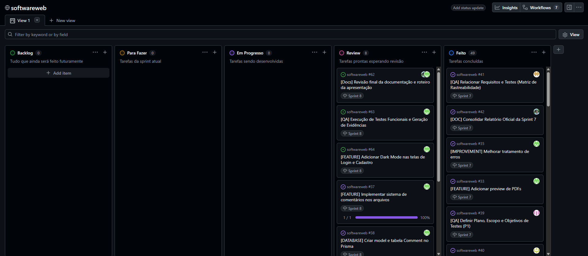

# Sprint 08

## 1. Identificação

- **Número da sprint:** 8
- **Período:** 23/05/2026 a 03/06/2026
- **Data da entrega:** 03/06/2026

| Integrante | Papel no Scrum |
|---|---|
| Thiago Vinícius Tristão Rojas | Product Owner |
| Bruno Santos Vilas Boas | Scrum Master |
| Christian Silva Mesquita | Dev Team |
| Guilherme dos Santos Fernandes | Dev Team |
| Matheus Levi Tavares | Dev Team |

---

## 2. Objetivo da Sprint

Consolidar toda a documentação do projeto DisciplinasUFLA, revisar os incrementos produzidos ao longo das sprints, executar os testes planejados na Sprint 07, registrar evidências de validação da aplicação e preparar a versão final para apresentação.

---

## 3. Itens do Sprint Backlog

| ID    | Tipo         | Item do Backlog                | Descrição                                  | Prioridade | Status    |
| ----- | ------------ | ------------------------------ | ------------------------------------------ | ---------- | --------- |
| QA04  | Qualidade    | Execução dos Casos de Teste    | Executar CT01 a CT08                       | Alta       | Concluído |
| QA05  | Qualidade    | Registro das Evidências        | Documentar resultados dos testes           | Alta       | Concluído |
| DOC03 | Documentação | Consolidação dos Artefatos     | Revisar e organizar documentação final     | Alta       | Concluído |
| DOC04 | Documentação | Atualização do Product Backlog | Registrar situação final dos requisitos    | Média      | Concluído |
| DOC05 | Documentação | Histórico das Sprints          | Consolidar evolução do projeto             | Média      | Concluído |
| DOC06 | Documentação | Preparação da Apresentação     | Organizar material para demonstração final | Média      | Concluído |

---

## 4. Relação com o Conteúdo da Disciplina

Esta sprint está relacionada à etapa final da disciplina, integrando os conteúdos de requisitos, modelagem, princípios de projeto, padrões de projeto, arquitetura e testes de software. O foco principal foi validar os incrementos produzidos, consolidar a documentação e demonstrar a evolução do sistema ao longo do semestre.

---

## 5. Artefatos Produzidos

* Documentação consolidada do projeto
* Product Backlog final atualizado
* Evidências dos testes executados
* Histórico resumido das sprints
* Revisão dos incrementos desenvolvidos
* Preparação da apresentação final
* Arquivo docs/sprints/sprint-08.md

---

## 6. Evolução da Aplicação Web

Ao final da Sprint 8, a aplicação DisciplinasUFLA encontra-se funcional e pronta para demonstração.

As principais funcionalidades implementadas incluem:

* Cadastro de usuários com e-mail institucional
* Login com autenticação JWT
* Upload de materiais acadêmicos
* Download de arquivos
* Busca de conteúdos
* Filtro por disciplina
* Sistema de curtidas
* Sistema de favoritos
* Sistema de comentários
* Perfil de usuário
* Edição e exclusão de materiais
* Dark Mode
* Painel administrativo

A solução evoluiu progressivamente durante as oito sprints, passando da definição do problema até a validação dos requisitos implementados.

---

## 7. Dificuldades Encontradas

* Consolidação dos artefatos produzidos ao longo das oito sprints.
* Organização das evidências de teste para documentação final.
* Revisão da rastreabilidade entre requisitos, backlog, implementação e testes.
* Garantia de consistência entre toda a documentação do projeto.

---

## 8. Revisão do Incremento

### O que foi concluído

* Execução dos casos de teste definidos na Sprint 07.
* Registro das evidências de validação.
* Consolidação da documentação do projeto.
* Atualização final do Product Backlog.
* Revisão dos incrementos produzidos.
* Preparação da apresentação final.

### O que ficou pendente

* Não foram identificadas pendências críticas para a entrega final.

---

## 9. Histórico Resumido das Sprints

### Sprint 01

Definição do problema, visão do produto, organização inicial do Scrum e criação do repositório.

### Sprint 02

Levantamento, análise e priorização dos requisitos funcionais e não funcionais.

### Sprint 03

Modelagem da solução utilizando diagramas e representações do sistema.

### Sprint 04

Definição dos módulos da aplicação e justificativa das decisões de projeto.

### Sprint 05

Aplicação e documentação dos padrões de projeto adotados.

### Sprint 06

Definição da arquitetura da solução e organização dos componentes.

### Sprint 07

Planejamento dos testes, elaboração dos casos de teste e matriz de rastreabilidade.

### Sprint 08

Execução dos testes, validação da solução e consolidação final do projeto.

---

## 10. Evidências de Validação

Os testes definidos na Sprint 07 foram executados com sucesso.

| Caso de Teste                               | Resultado |
| ------------------------------------------- | --------- |
| CT01 - Login Institucional                  | Aprovado  |
| CT02 - Bloqueio de E-mail Não Institucional | Aprovado  |
| CT03 - Upload de Material                   | Aprovado  |
| CT04 - Restrição de Arquivos Acima de 100MB | Aprovado  |
| CT05 - Download de Arquivos                 | Aprovado  |
| CT06 - Sistema de Curtidas                  | Aprovado  |
| CT07 - Busca e Filtro                       | Aprovado  |
| CT08 - Cadastro de Usuário                  | Aprovado  |

Nenhum bug crítico foi identificado durante os testes realizados.

---

## 11. Product Backlog Final

Todos os requisitos funcionais e não funcionais previstos para a versão final foram concluídos.

### Requisitos Funcionais
CT01
RF01 ao RF18: Concluídos.

### Requisitos Não Funcionais

RNF01 ao RNF06: Concluídos.

---

## 12. Preparação da Apresentação Final

* Revisão dos artefatos produzidos.
* Organização dos slides.
* Definição do roteiro da apresentação.
* Preparação da demonstração da aplicação.
* Revisão dos resultados alcançados.
* Revisão da utilização do Scrum durante o projeto.

---

## 13. Quadro Kanban Final

---

## 14. Considerações Finais

O projeto DisciplinasUFLA atingiu os objetivos definidos no início do semestre, oferecendo uma plataforma web para compartilhamento de materiais acadêmicos entre estudantes da UFLA. A aplicação foi desenvolvida de forma incremental utilizando Scrum, mantendo rastreabilidade entre requisitos, backlog, implementação e testes. Os resultados obtidos demonstram a viabilidade da solução proposta e a aplicação prática dos conceitos estudados na disciplina de Engenharia de Software.
